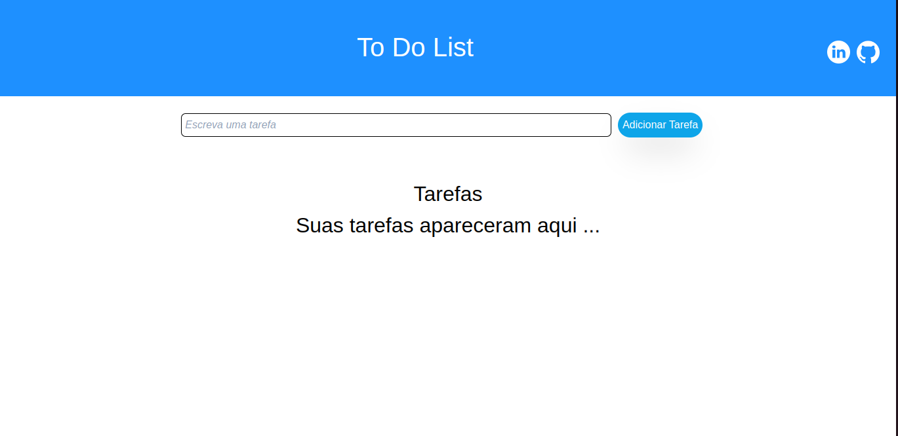
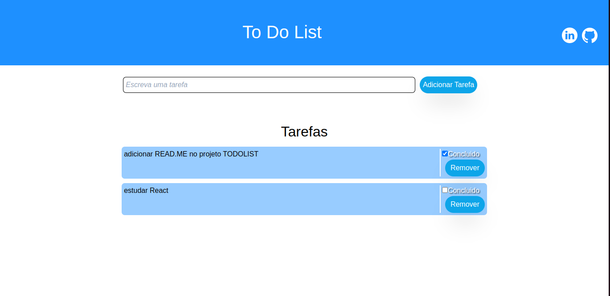
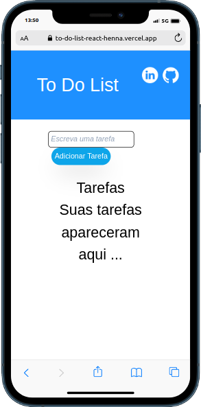
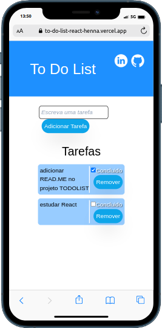

# To Do List

Uma página web para adicionar tarefas do dia a dia, com funcionalidades de concluir e remover tarefas.          
[Acesse aqui a página](https://to-do-list-react-henna.vercel.app/)

## Funcionalidades

- Adicionar nova tarefa
- Remover uma tarefa
- Marca como concluido uma tarefa
- Salvo no localStorage
- Multiplataforma

## Apêndice

A aplicação web foi feita com React, utitlizando state, props e componentização 

## Screenshots

## Autores

- [Alessandra Romuado](https://www.github.com/AlessandraRomualdo)

